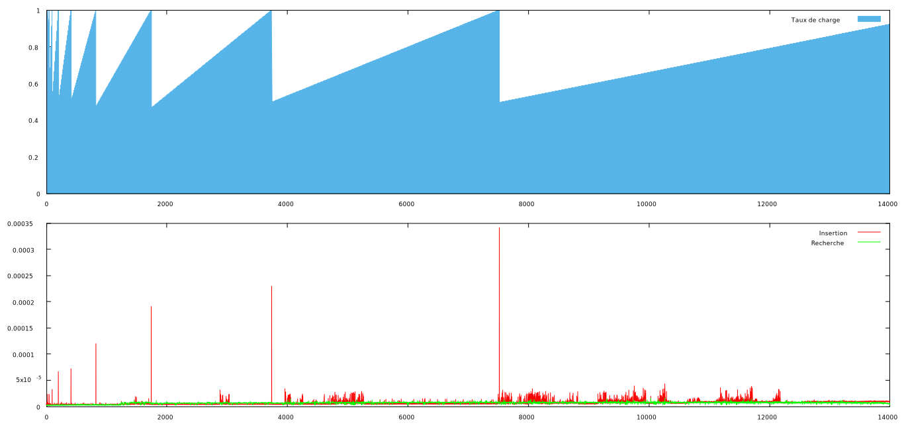
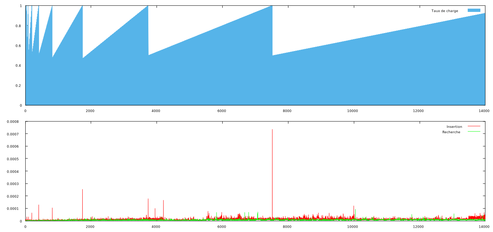

#
Résultats

Les résultats obtenus par le programme, expliqués par des graphiques.

 
##Théorique

Les résultats théoriques devraient être les suivants, l'avantage de la table de hachage est de très bien fonctionner même avec une grande taille.

Les complexités attendues sont de l'ordre de <b>O(1)</b> pour l'insertion et pour la recherche. Car la table passe par des hash et n'a donc pas besoin de parcourir toute la table pour savoir si une clé se trouve dedans ou non.

##Pratique

Les résultats pratiquent corroborent avec les hypothèses émises plus haut, on à une insertion et une recherche de l'ordre de <b>O(1)</b>.

 

_Taille de 0 à 13996 mots avec des moyennes de 200 itérations_

 

On remarque cependant des pics très nets lors de certaines insertions, qui correspondent à la réallocation de la table lorsque cette dernière devient trop petite. Ces pics coïncident avec les chutes de taux de charge de la table, sans surprise.

Là ou je suis plus surpris, c'est en faisant varier le nombre d'itérations pour les moyennes, là ou on devrait trouver des résultats plus disparates, moins lisses, le résultat théoriquement 20 fois moins "lisse" que le précédent l'est presque autant :

 

_Taille de 0 à 13996 mots avec des moyennes de 10 itérations_

 
